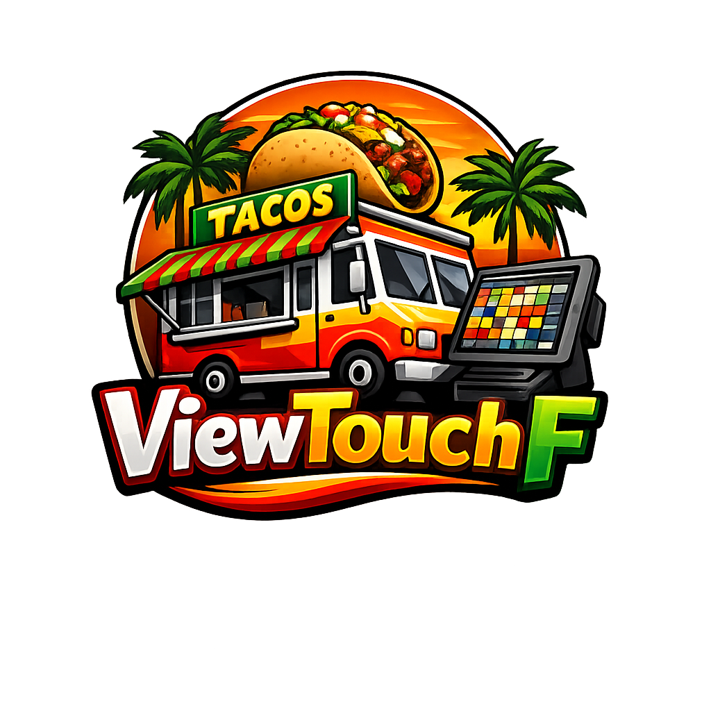
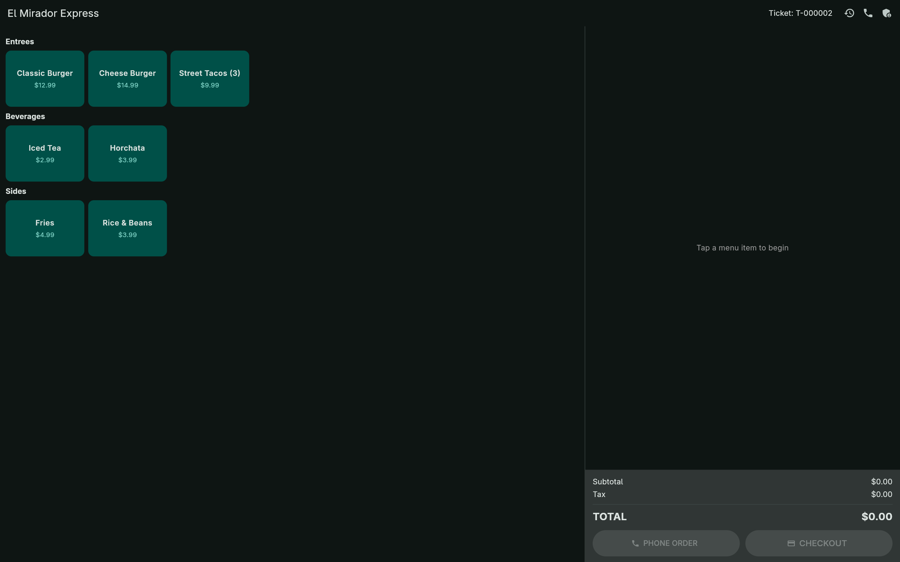
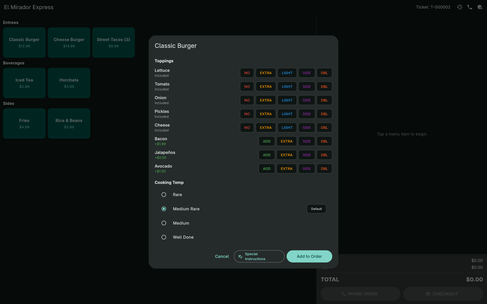
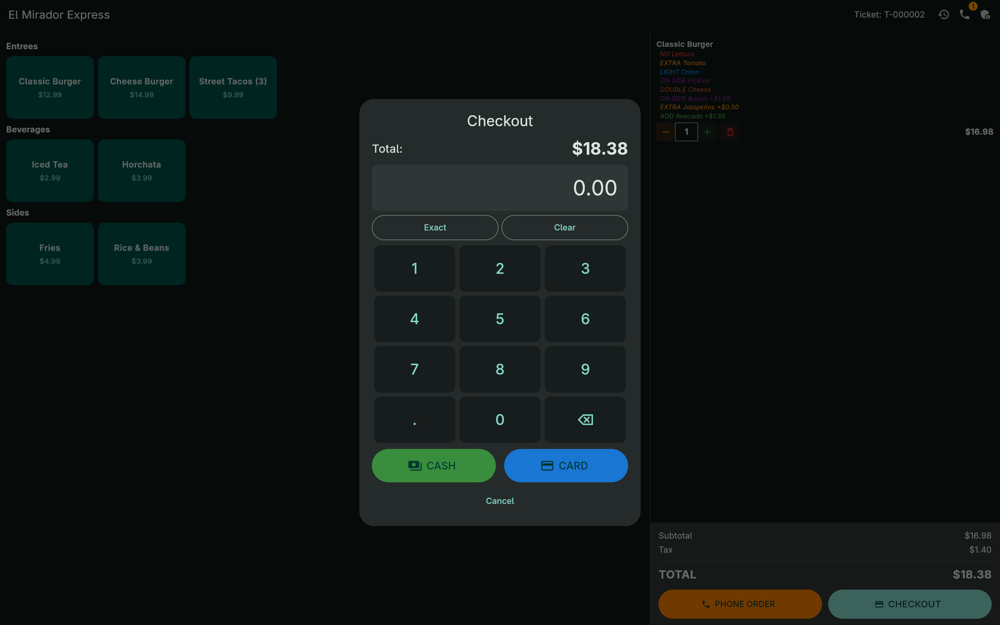
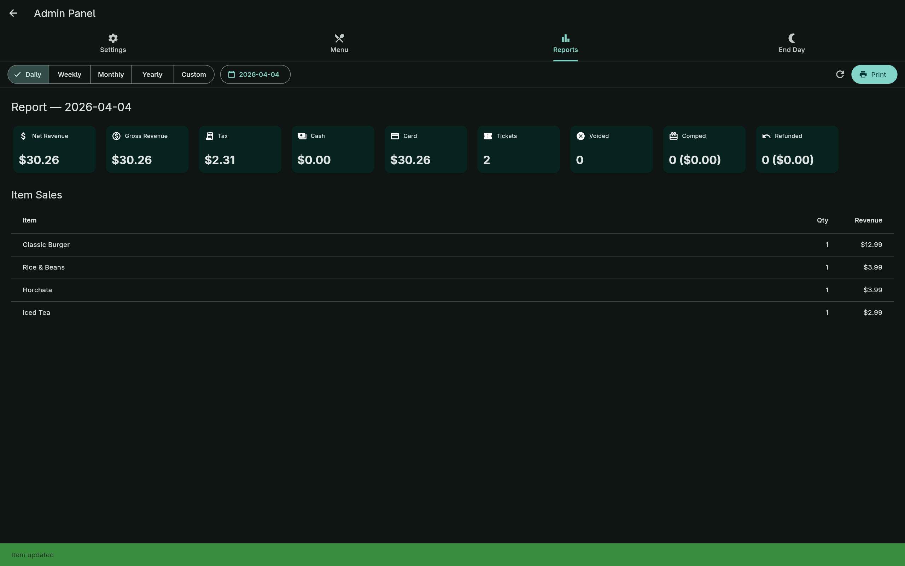
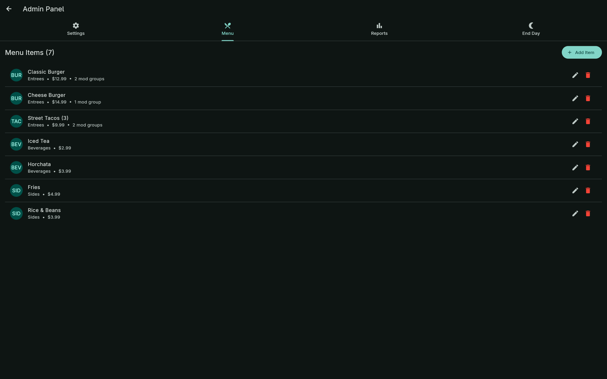

<p align="center">
  
  <h1 align="center">ViewTouchF</h1>
  <p align="center"><strong>Open-source Point of Sale for food trucks & restaurants</strong></p>
</p>

[](LICENSE) []() []()

---

## Overview

ViewTouchF is a production-ready Point of Sale (POS) system focused on touch-first, high-throughput environments such as food trucks and quick-service restaurants. The project pairs a lightweight C++ daemon for backend business logic and printing with a Flutter-based touchscreen frontend communicating via gRPC over a Unix domain socket.

Key goals:

- Fast, reliable ticket processing and printing
- Touch-optimized register and admin workflows
- Extensible protobuf-defined gRPC API for integration and testing

## Table of Contents

1. [Features](#features)
2. [Architecture](#architecture)
3. [Screenshots](#screenshots)
4. [Quick Start](#quick-start)
5. [Building](#building)
6. [Deployment](#deployment)
7. [Contributing](#contributing)
8. [License](#license)

---

## Features

- Touch-optimized register with categorized menu grid and modifiers
- Split payments (cash + card), change calculations, and CC fee support
- Past orders: filter, reprint, void, comp, or refund
- Dual-printer support (receipt + kitchen) via CUPS and ESC/POS
- End-of-day Z-reports and detailed accounting-friendly reports
- Menu CRUD with modifier groups, per-modifier pricing, and printer mapping

## Architecture

The system is split into two main components:

- `vt_daemon` (C++17): business logic, ticket lifecycle, printer integration, and gRPC server
- `flutter_ui` (Dart / Flutter): touch-first register, admin panel, and reporting client

They communicate over a protobuf-defined gRPC service (`proto/pos_service.proto`) using a Unix socket (default: `/tmp/viewtouch/pos.sock`).

```text
Flutter UI  <---- gRPC over UDS ---->  vt_daemon (C++17)
```

---

## Screenshots

Register and admin screenshots (click to view):

-     
-     

---

## Quick Start

Prerequisites:

- CMake, a modern C++ compiler (C++17), gRPC/Protobuf toolchain
- Flutter SDK for building the Linux UI

Build everything with the provided script (recommended):

```bash
./build.sh
```

Run the daemon and the UI:

```bash
# Start the daemon (creates /tmp/viewtouch/pos.sock)
./build/vt_daemon &

# Launch the Flutter UI (development)
cd flutter_ui && flutter run -d linux
```

See [CHANGELOG.md](CHANGELOG.md) for recent release notes and [LICENSE](LICENSE) for licensing details.

---

## Building (individual components)

Daemon (C++):

```bash
cmake -B build -DCMAKE_BUILD_TYPE=Release
cmake --build build -j$(nproc)
```

Generate Dart gRPC stubs from proto (if modifying `proto/`):

```bash
protoc --proto_path=proto --dart_out=grpc:flutter_ui/lib/generated proto/pos_service.proto
```

Flutter UI (Linux):

```bash
cd flutter_ui
flutter pub get
flutter build linux --release
```

---

## Deployment

Install the daemon as a system service (example):

```bash
sudo mkdir -p /opt/viewtouch
sudo cp build/vt_daemon /opt/viewtouch/
sudo cp deploy/vt-daemon.service /etc/systemd/system/
sudo systemctl daemon-reload
sudo systemctl enable --now vt-daemon
```

Adjust user/group and printer permissions according to your environment.

---

## Contributing

Contributions are welcome. Please:

1. Open an issue to discuss major changes.
2. Fork the repository, create a feature branch, and submit a pull request.
3. Run the project's linters and `pre-commit` hooks before submitting.

For development notes and conventions, see the source tree (C++ under `src/` and Flutter under `flutter_ui/`).

---

## License

This project is released under the GNU General Public License v3.0. See [LICENSE](LICENSE) for details.

---

*Maintained by the ViewTouchF contributors.*
